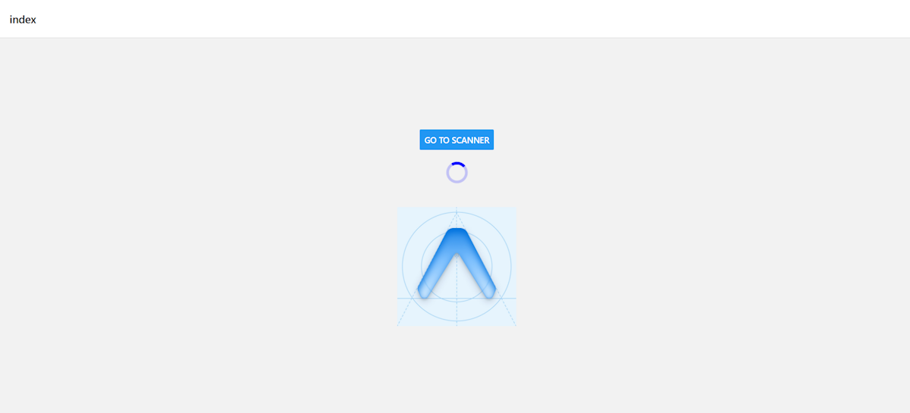

# Foodlogger POC



Een proof of concept mobiele applicatie gebouwd met Expo, gericht op het testen van barcode-scanning voor voedingsproducten.  
Dit project onderzoekt of het scannen van barcodes en het ophalen van voedingswaarden een realistische oplossing is voor een toekomstige voedingstracker applicatie.  
Het project is ontwikkeld als onderdeel van mijn HBO-ICT opleiding.

---

## Live Demo

- Web versie: https://food-logger-app.expo.app/  
- Android APK: https://expo.dev/accounts/maarten0162/projects/Food-Logger-React-App/builds/ab061147-e35d-4f7b-ac4c-a5930fab3f1f  
- GitHub Repository: https://github.com/Maarten0162/Food-Logger-React-App

---

## Overzicht

Het Foodlogger POC project is gemaakt om:

- Te onderzoeken of barcode-scanning geschikt is voor een voedingstracker  
- Camera-integratie in een mobiele app te testen  
- Voedingswaarden van producten op te halen via een externe API  
- Een technische basis te leggen voor een volledige foodlogger applicatie  

De focus ligt op functionaliteit en haalbaarheid, niet op een complete eindapplicatie.

---

## Functionaliteiten

### Barcode scanning met camera
De applicatie maakt gebruik van de device camera om barcodes van voedingsproducten te scannen.  
Na het scannen wordt de barcode gebruikt om productinformatie op te halen.

---

### Voedingswaarden ophalen via API
Na het scannen van een product worden de voedingswaarden opgehaald via de Open Food Facts API:

https://world.openfoodfacts.org/

De app toont onder andere:
- Productnaam
- Energie (kcal)
- Basis voedingswaarden

---

### Proof of Concept scope
De applicatie is bewust beperkt gehouden:

- Geen gebruikersaccounts  
- Geen opslag van voedingsdata per dag  
- Geen database-integratie  

Het doel is validatie van het concept, niet een complete foodtracking-oplossing.

---

## Platform ondersteuning

- Android  
- Web (Expo)  

iOS is gepland voor de uiteindelijke volledige versie van de applicatie.

---

## Toekomstige uitbreidingen

Dit project dient als basis voor een volledige foodlogger applicatie, waarin onder andere wordt toegevoegd:

- Dagelijkse voedingsregistratie  
- Opslag van data per gebruiker  
- Uitgebreidere voedingsanalyse  
- Mogelijke barcode- of foodherkenning uitbreidingen  

---

## Gebruikte Technologieën

- Framework: Expo ~54.0.12  
- Taal: TypeScript ~5.9.2  
- Platform: Android, Web  
- Camera: expo-camera ~17.0.9  
- API: Open Food Facts API  
- Routing: Expo Router ~6.0.10  
- Development: Expo Go


Er is testcode aanwezig voor backend-functionaliteit, maar deze wordt in deze proof of concept nog niet actief gebruikt.

---

## Bestandsstructuur

```txt
Food-Logger-React-App/
├── .gitattributes
├── .gitignore
├── .vscode/
│   ├── extensions.json
│   └── settings.json
├── app/
│   ├── _layout.tsx
│   └── index.tsx
├── app.json
├── assets/
│   └── images/
│       ├── android-icon-background.png
│       ├── android-icon-foreground.png
│       ├── android-icon-monochrome.png
│       ├── favicon.png
│       ├── icon.png
│       ├── partial-react-logo.png
│       ├── react-logo.png
│       ├── react-logo@2x.png
│       ├── react-logo@3x.png
│       └── splash-icon.png
├── eslint.config.js
├── package-lock.json
├── package.json
├── README.md
└── tsconfig.json

```

```bash
# Clone de repository
git clone https://github.com/Maarten0162/Food-Logger-React-App.git

# Ga naar de projectmap
cd Food-Logger-React-App

# Installeer dependencies
npm install

# Start de Expo development server
npx expo start
```


## License
MIT License

Copyright (c) 2025 Maarten van den Berg

Permission is hereby granted, free of charge, to any person obtaining a copy
of this software and associated documentation files (the "Software"), to deal
in the Software without restriction, including without limitation the rights
to use, copy, modify, merge, publish, distribute, sublicense, and/or sell
copies of the Software, and to permit persons to whom the Software is
furnished to do so, subject to the following conditions:

The above copyright notice and this permission notice shall be included in all
copies or substantial portions of the Software.

THE SOFTWARE IS PROVIDED "AS IS", WITHOUT WARRANTY OF ANY KIND, EXPRESS OR
IMPLIED, INCLUDING BUT NOT LIMITED TO THE WARRANTIES OF MERCHANTABILITY,
FITNESS FOR A PARTICULAR PURPOSE AND NONINFRINGEMENT. IN NO EVENT SHALL THE
AUTHORS OR COPYRIGHT HOLDERS BE LIABLE FOR ANY CLAIM, DAMAGES OR OTHER
LIABILITY, WHETHER IN AN ACTION OF CONTRACT, TORT OR OTHERWISE, ARISING FROM,
OUT OF OR IN CONNECTION WITH THE SOFTWARE OR THE USE OR OTHER DEALINGS IN THE
SOFTWARE.
